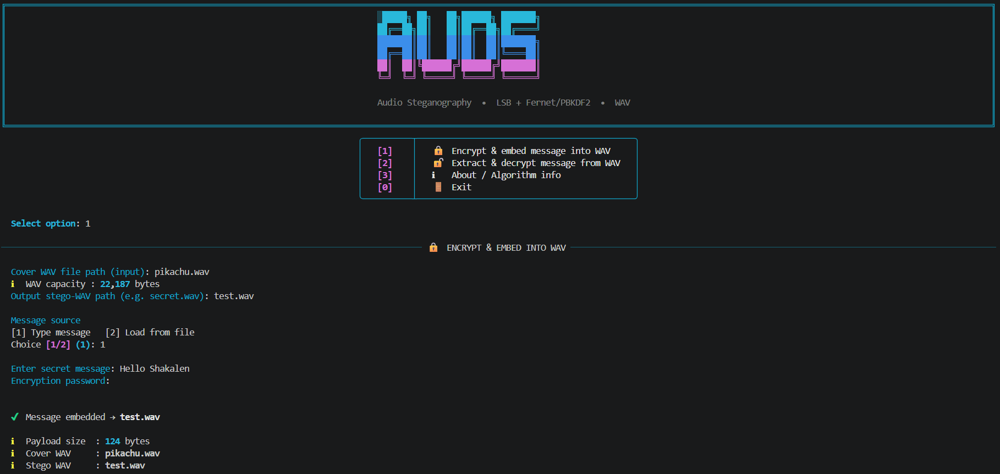
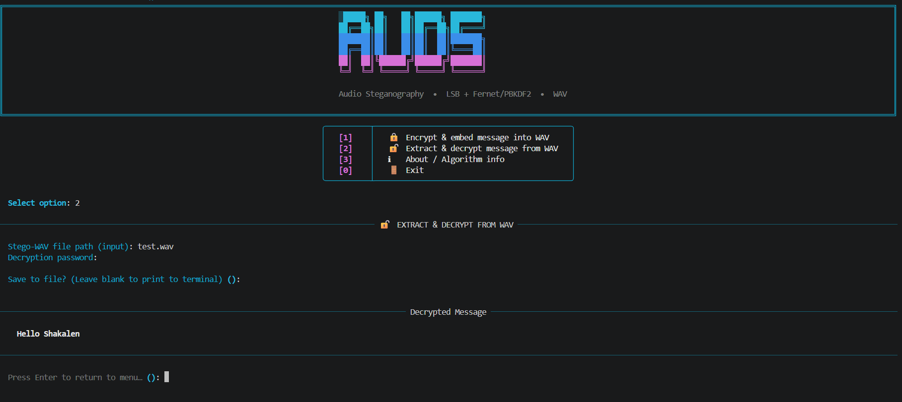
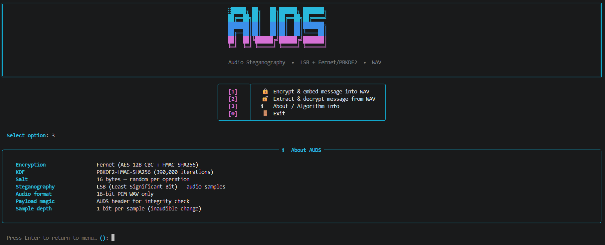
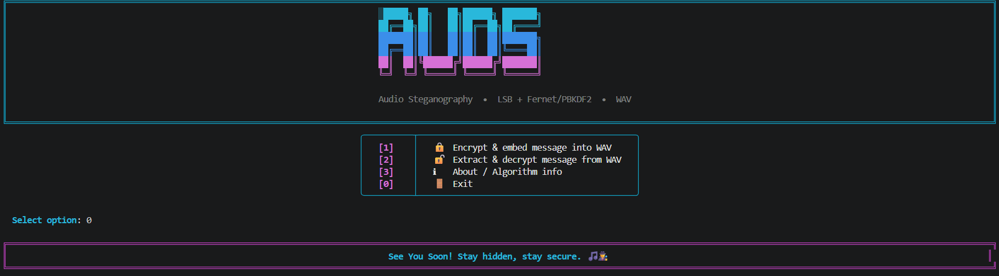

# 🎵 Audio-Steganography-CLI-Tool 🔐

A Python-based **Audio Steganography Command Line Tool** that allows you to **encrypt a hidden message** and embed it inside a **16-bit WAV audio file**, and later **extract & decrypt** it using a password.
This CLI tool uses **Fernet encryption**, **PBKDF2-HMAC key derivation**, and **LSB-based audio steganography**, designed for terminal users, scripting, and automation.

---

## 🧱 Project Structure

```
Audio-Steganography-CLI-Tool/
│
├── assets/                # Screenshots
├── main.py                # Basic CLI Version
├── interactive.py         # Rich-powered CLI
├── requirements.txt       # Dependencies
└── README.md              # Project documentation
```

---

## ✨ Features

### 🔐 Encryption & Embedding

- Encrypts message using **Fernet (AES-128 authenticated encryption)**
- Derives key from password using **PBKDF2-HMAC (SHA256)**
- Embeds encrypted payload into WAV audio using **LSB (Least Significant Bit)**

### 🔓 Extraction & Decryption

- Extracts embedded payload from WAV
- Uses stored salt to regenerate the Fernet key
- Decrypts message securely
- Prints decrypted message directly in terminal

### 🎨 Rich CLI (Interactive Mode)
- Beautiful colored terminal UI using Rich
- Displays key matrix in a structured table
- Interactive prompts with validation
- Clean and readable output panels

### ⚡ Dual Mode Support
- 🧼 Basic CLI → Lightweight, no dependencies
- 🎨 Rich CLI → Enhanced UI with colors and panels

---

## 🛠 Technologies Used

| Technology                             | Role                      |
| -------------------------------------- | ------------------------- |
| **Python 3**                           | Main language             |
| **argparse**                           | CLI argument parsing      |
| **wave module**                        | WAV file operations       |
| **array module**                       | Audio sample manipulation |
| **cryptography (Fernet + PBKDF2HMAC)** | Encryption                |
| **LSB Steganography**                  | Data embedding            |
| **Rich**                               | Styled CLI, colors, panels |

---

## ▶️ How to Run

### 1️⃣ Clone the repository
```bash
git clone https://github.com/ShakalBhau0001/Audio-Steganography-CLI-Tool.git
```

### 2️⃣ Navigate to the project folder
```bash
cd Audio-Steganography-CLI-Tool
```

### 3️⃣ Install Dependencies

```bash
pip install rich cryptography
```

**OR**

```bash
pip install -r requirements.txt
```

---

### 3️⃣ Running the Project

#### 🧼 Basic CLI Version

```bash
python main.py
```

#### 🎨 Rich Interactive Version

```bash
python interactive.py
```

---

## ▶️ Usage

### 🔐 Encrypt & Embed

#### 1. Text Encrypt & Embed

> Syntax :

```bash
python main.py encrypt --in-wav inputfile.wav --out-wav outputfile.wav --password yourpassword --message "Enter Your Secret Message"
```

> Example :

``` bash
python main.py encrypt --in-wav cover.wav --out-wav stego.wav --password mypass --message "secret"
```

#### 2. Text File Encrypt & Embed

> Syntax :

```bash
python main.py encrypt --in-wav inputfile.wav --out-wav outputfile.wav --password yourpassword --message-file Add Your Secret txt file
```

> Example :

``` bash
python main.py encrypt --in-wav cover.wav --out-wav stego.wav --password mypass --message-file secret.txt
```

### 🔓 Decrypt & Extract

> Syntax :

```bash
python main.py decrypt --in-wav outputfile.wav --password yourpassword
```

> Example :

``` bash
python main.py decrypt --in-wav stego.wav --password mypass
```

---

## 📁 Supported Format

- **Input (Carrier):** 16-bit PCM **WAV** only
- **Output (Stego Audio):** WAV
- **Message Input:** Text or `.txt` file

> ⚠️ If audio is not 16-bit PCM, the app will reject it.

---

## ⚙️ How It Works

**1️⃣ Key Derivation**

- Password → PBKDF2-HMAC(SHA256, 390k iterations) → 32-byte key → Fernet key

**2️⃣ Encryption**

- Message encrypted using Fernet
- Payload format:
  ```bash
  [AUDS][16-byte salt][4-byte length][encrypted data]
  ```

**3️⃣ Embedding**

- Payload bits are inserted into **LSB of audio samples.**

**4️⃣ Extraction**

- Reads LSB bits
- Reconstructs payload
- Validates header
- Re-derives Fernet key
- Decrypts message

---

## ⚠️ Common Errors

- **Wrong password** → Decryption fails
- **Non-16-bit WAV** → Rejected
- **Small audio file** → Payload too large
- **Wrong WAV file** → MAGIC header not found

---

## 🌟 Future Enhancements

- Add support for larger audio files
- Add progress bar during embedding
- Add message file export option
- Improve error handling for corrupted audio
- Add option for binary file hiding

---

## 📦 Extended Version

This repository focuses on a **specific steganography technique** implemented
as a **command-line (CLI) learning project**.

The goal of this project is to:
- Understand how steganography works at a practical level  
- Experiment with data hiding techniques  
- Learn how CLI-based security tools are structured  

For a **more advanced and combined implementation** that includes:
- Image steganography  
- Audio steganography  
- File encryption support  

please refer to:

🔗 **[StegaVault-CLI](https://github.com/ShakalBhau0001/StegaVault-CLI)**

---

## ⚠️ Disclaimer

This project is intended for **educational and research purposes only**.

It is **not designed for real-world secure communication**.
Steganography alone does not guarantee secrecy and should not be considered
a replacement for proper cryptographic security.

---

## 📸 Preview

### 1. **Encryption**



### 2. **Decryption**



### 3. **Info**



### 4. **Exit**



---

## 🪪 Author

> **Creator: Shakal Bhau**

> **GitHub: [ShakalBhau0001](https://github.com/ShakalBhau0001)**

---

## ⭐ Support

If you like this project, consider giving it a ⭐ on GitHub!

---
